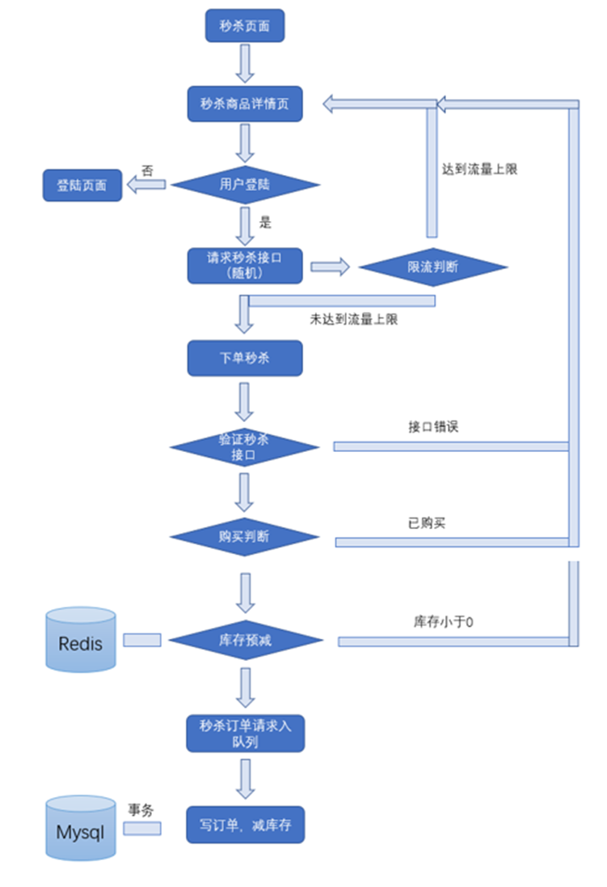
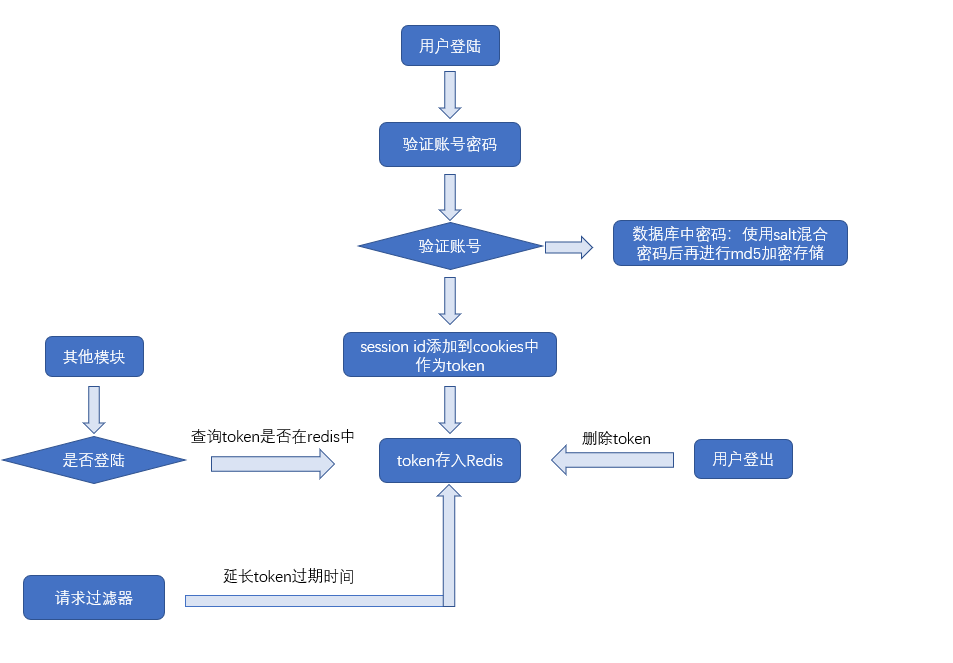
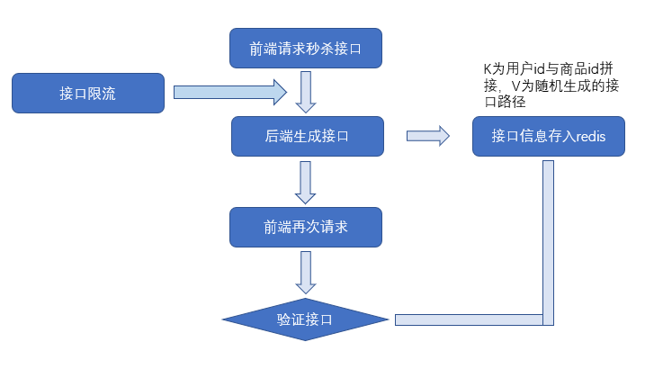
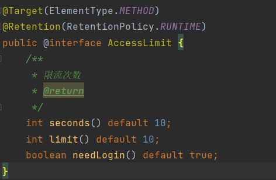
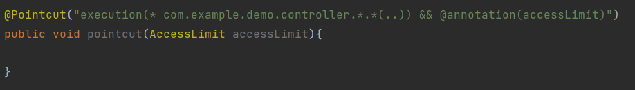

# 项目的整体流程图：

# 采用组件：

springboot 2.4.3

mysql 8.0.21

redis 3.2.1

rabbitmq 3.8.11

java 11

# 实现功能:

使用redis缓存了商品的数量，用户信息等数据
mysql存储了用户，商品，订单信息。

项目可以分为两个模块，登陆和秒杀
登陆功能主要依赖在redis中缓存session id作为token，验证用户，实现了用户token有效期的自动延长
秒杀模块采用了隐藏秒杀接口，接口限流，消息队列削峰来实现高并发。

## 登陆模块流程图:

其中请求过滤功能在com.example.demo.interceptor包下的UserSessionExpire类中实现，主要就是过滤请求，然后判断用户是否登陆，如果登陆的话则在redis中延长用户token的有效期

## 秒杀模块：

### 隐藏接口：

### 接口限流：

主要使用注解加AOP实现

 AOP拦截：

AOP拦截时判断判断redis中某一接口的数量，再与最大请求数对比。

如果小于最大请求数，则将redis中接口的请求数加1，

如果大于等于最大请求数，则直接拒接访问

接口在redis中的有效期也就是注解中定义的时间。

这是利用redis的expire特性，实现时间窗口内某个接口的请求数限流。

### 消息队列执行下单，减库存：

消息队列采用了rabbitMQ，利用send和receive特性达到了流量削峰。

下订单，减库存利用了spring的@Transactional注解实现了事务。

